# Special Topics Power Distribution Networks 

The project provides an introduction to power distribution networks. Confidential information is not displayed. 

Please download the executable in https://github.com/alpaddesai/PowerDistributionNetworks/releases for details. 

All images are either custom by Alpa D Desai or a reference name is included. Most of the images are custom.

## Agenda
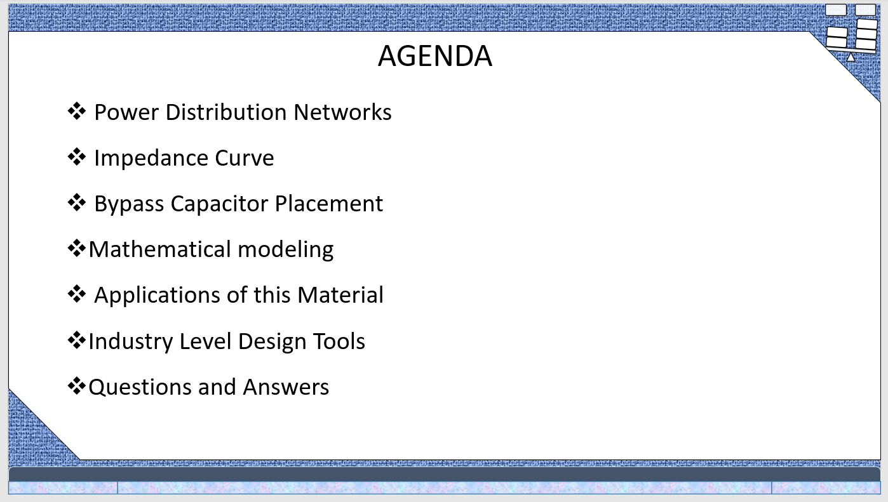

## Problem Statement
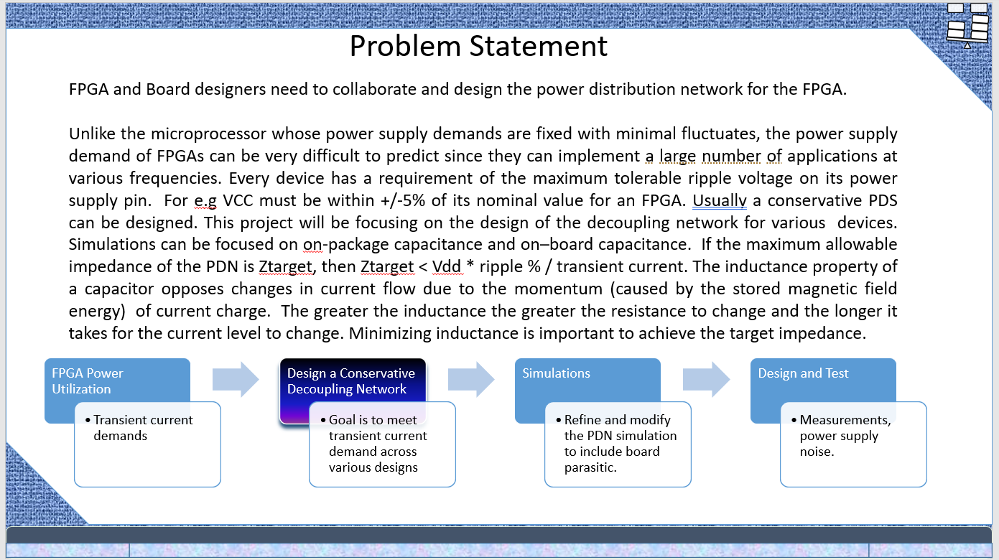

## Evolution of PDN in microprocessors
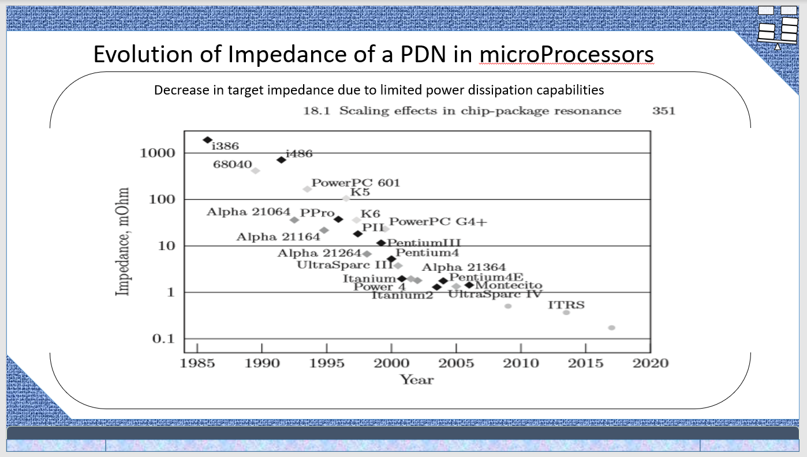

## Power Distribution Networks
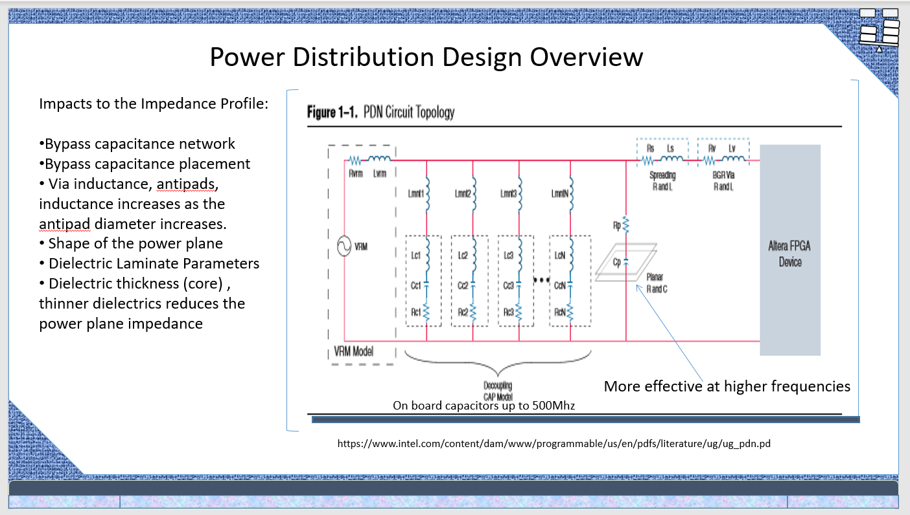

## Explanation of Impedance Profile Chart
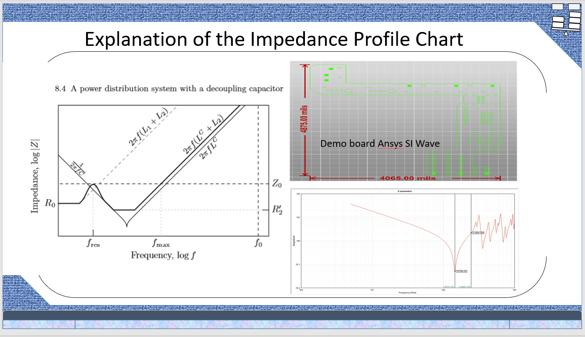

## Impact of bypass capacitors
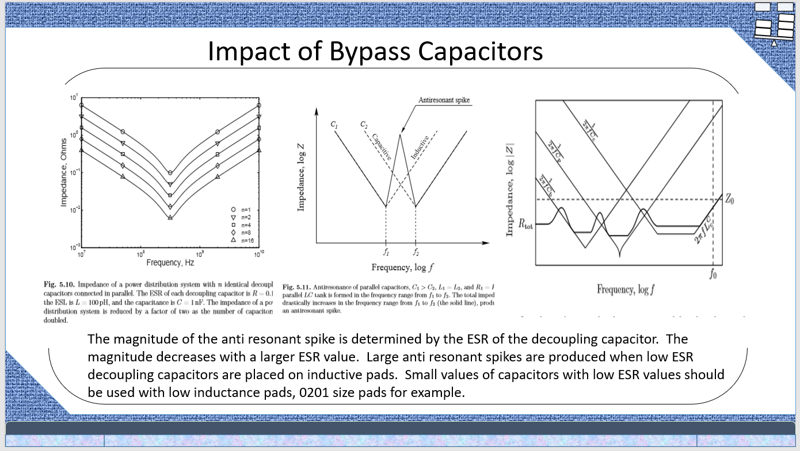

## Capacitor placement and lab measurements of PDN
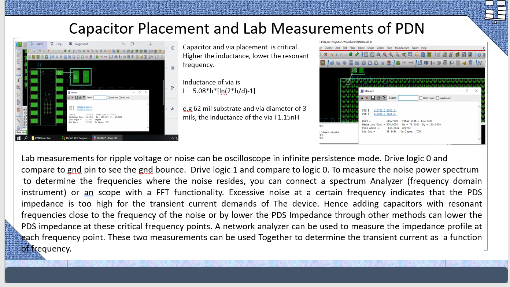

## Industry level design tools and power integrity analysis
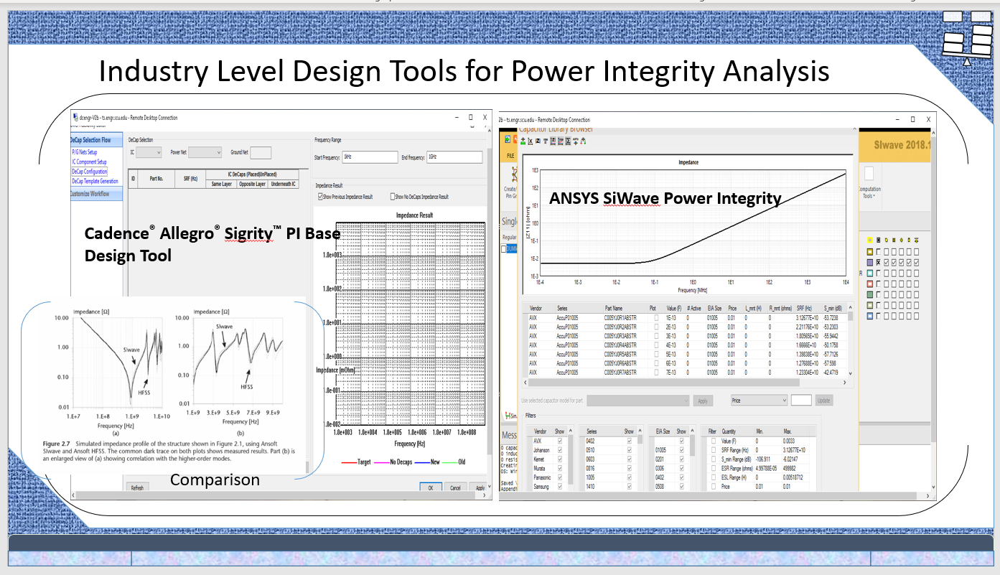

## On chip decoupling capacitors
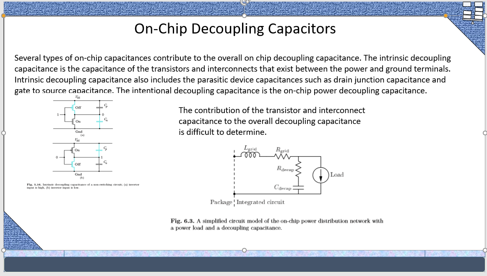
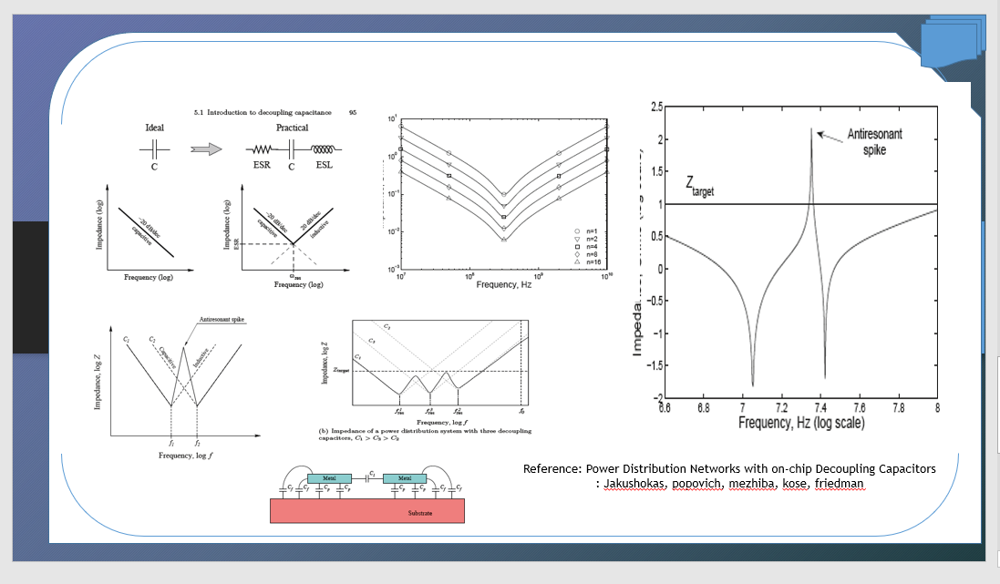

## References
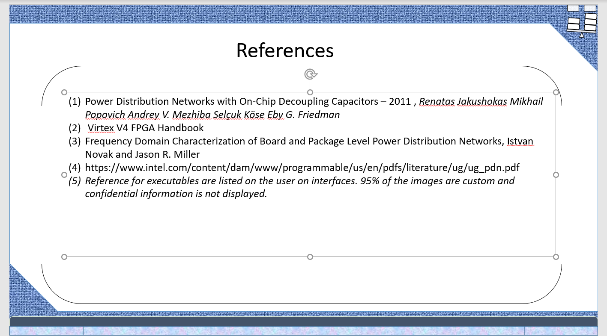

## SIWave Demo Board
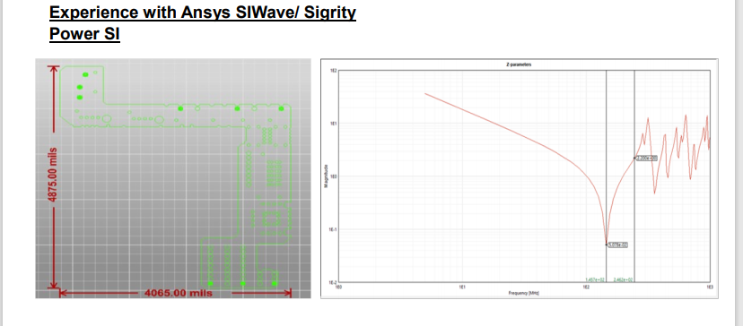

### Sigrity Power DC

## Sigrity PI
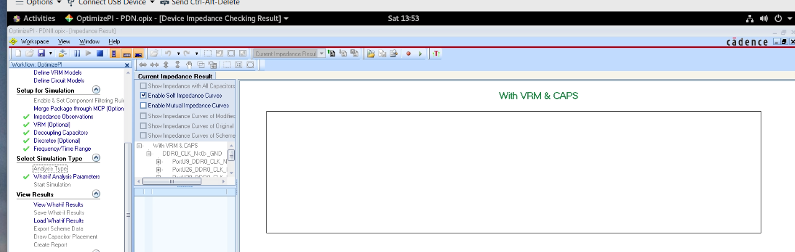

## Simulations

## Ethics and Integrity

Additional details reference https://github.com/alpaddesai/ArchitecturalProductDesign
